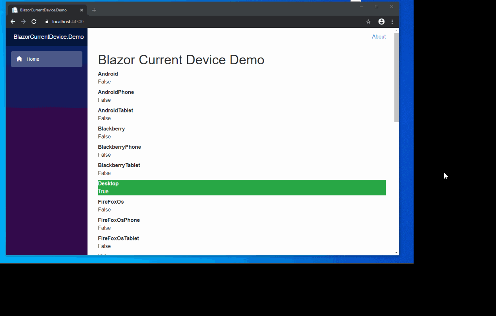

# BlazorCurrentDevice

<p>
    	<a href="https://www.nuget.org/packages/BlazorCurrentDevice">
	    
	</a>
</p>



Device detection for blazor using current-device.js

## Installation

`Install-Package BlazorCurrentDevice -Version 1.0.7`

## Add reference in \_Imports.razor

`@using BlazorCurrentDevice`

## Add the service in your services method

`services.AddBlazorCurrentDevice();`

## Add javascript library reference in your index.html or \_Host.cshtml

`<script src="_content/BlazorCurrentDevice/current-device.min.js"></script>`

## Usage

`[Inject] IBlazorCurrentDeviceService BlazorCurrentDeviceService { get; set; }`
or

```cs
@inject IBlazorCurrentDeviceService BlazorCurrentDeviceService
```

#### Device Methods

<table>
	<tr>
		<th>BlazorCurrentDeviceService</th>
		<th>Method</th>
	</tr>
	<tr>
		<td>Mobile</td>
		<td>BlazorCurrentDeviceService.Mobile()</td>
	</tr>
	<tr>
		<td>Tablet</td>
		<td>BlazorCurrentDeviceService.Tablet()</td>
	</tr>
	<tr>
		<td>Desktop</td>
		<td>BlazorCurrentDeviceService.Desktop()</td>
	</tr>
	<tr>
		<td>iOS</td>
		<td>BlazorCurrentDeviceService.iOS()</td>
	</tr>
	<tr>
		<td>iPad</td>
		<td>BlazorCurrentDeviceService.iPad()</td>
	</tr>
	<tr>
		<td>iPhone</td>
		<td>BlazorCurrentDeviceService.iPhone()</td>
	</tr>
	<tr>
		<td>iPod</td>
		<td>BlazorCurrentDeviceService.iPod()</td>
	</tr>
	<tr>
		<td>Android</td>
		<td>BlazorCurrentDeviceService.Android()</td>
	</tr>
	<tr>
		<td>Android Phone</td>
		<td>BlazorCurrentDeviceService.AndroidPhone()</td>
	</tr>
	<tr>
		<td>Android Tablet</td>
		<td>BlazorCurrentDeviceService.AndroidTablet()</td>
	</tr>
	<tr>
		<td>BlackBerry</td>
		<td>BlazorCurrentDeviceService.Blackberry()</td>
	</tr>
	<tr>
		<td>BlackBerry Phone</td>
		<td>BlazorCurrentDeviceService.BlackberryPhone()</td>
	</tr>
	<tr>
		<td>BlackBerry Tablet</td>
		<td>BlazorCurrentDeviceService.BlackberryTablet()</td>
	</tr>
	<tr>
		<td>Windows</td>
		<td>BlazorCurrentDeviceService.Windows()</td>
	</tr>
	<tr>
		<td>Windows Phone</td>
		<td>BlazorCurrentDeviceService.WindowsPhone()</td>
	</tr>
	<tr>
		<td>Windows Tablet</td>
		<td>BlazorCurrentDeviceService.WindowsTablet()</td>
	</tr>
	<tr>
		<td>Firefox OS</td>
		<td>BlazorCurrentDeviceService.FireFoxOs()</td>
	</tr>
	<tr>
		<td>Firefox OS Phone</td>
		<td>BlazorCurrentDeviceService.FireFoxOsPhone()</td>
	</tr>
	<tr>
		<td>Firefox OS Tablet</td>
		<td>BlazorCurrentDeviceService.FireFoxOsTablet()</td>
	</tr>
  <tr>
		<td>MacOs</td>
		<td>BlazorCurrentDeviceService.MacOs()</td>
	</tr>
	<tr>
		<td>MeeGo</td>
		<td>BlazorCurrentDeviceService.MeeGo()</td>
	</tr>
  <tr>
		<td>NodeWebkit</td>
		<td>BlazorCurrentDeviceService.NodeWebkit()</td>
	</tr>
   <tr>
		<td>Cordova</td>
		<td>BlazorCurrentDeviceService.Cordova()</td>
	</tr>
	<tr>
		<td>Television</td>
		<td>BlazorCurrentDeviceService.Television()</td>
	</tr>
</table>

#### Orientation Methods

<table>
	<tr>
		<th>Orientation</th>
		<th>Method</th>
	</tr>
	<tr>
		<td>Landscape</td>
		<td>BlazorCurrentDeviceService.Landscape()</td>
	</tr>
	<tr>
		<td>Portrait</td>
		<td>BlazorCurrentDeviceService.Portrait()</td>
	</tr>
</table>

### Useful Methods

<table>
	<tr>
		<th>Method</th>
		<th>Returns</th>
	</tr>
	<tr>
		<td>BlazorCurrentDeviceService.Type()</td>
		<td>'mobile', 'tablet', 'desktop', or 'unknown'</td>
	</tr>
	<tr>
		<td>BlazorCurrentDeviceService.Orientation()</td>
		<td>'landscape', 'portrait', or 'unknown'</td>
	</tr>
	<tr>
		<td>BlazorCurrentDeviceService.OS()</td>
		<td>'ios', 'iphone', 'ipad', 'ipod', 'android', 'blackberry', 'windows', 'macos', 'fxos', 'meego', 'television', or 'unknown'</td>
	</tr>
</table>

## TODO

- Implement onChangeOrientation callback

## License

MIT
